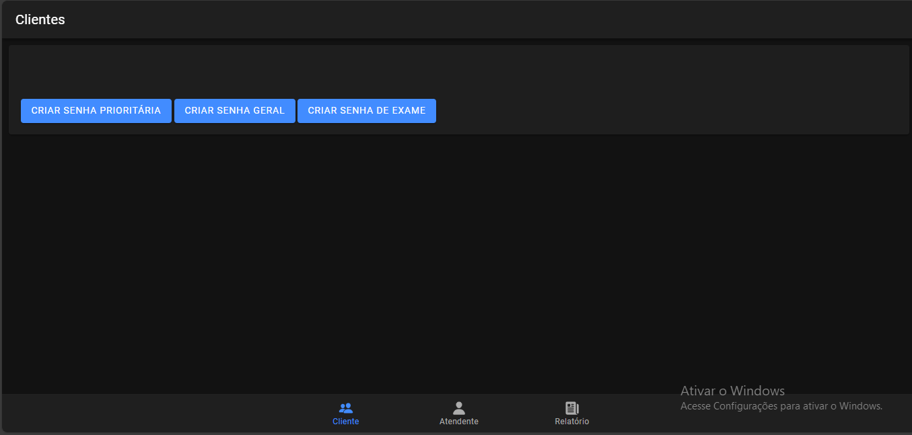
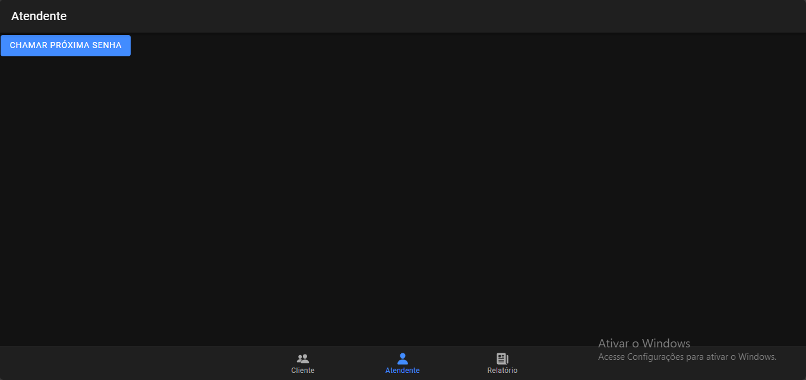

# tickets
# Sistema de Controle de Atendimento

Este projeto é um sistema de controle de atendimento utilizado em filas de laboratórios médicos, desenvolvido para gerenciar as senhas de atendimento e garantir que o processo de atendimento aos clientes seja eficiente. O sistema foi criado com **Node.js** no backend, **MySQL** como banco de dados e **Angular** no frontend, utilizando a estrutura do **Ionic**.

## Descrição do Sistema

O sistema de controle de atendimento é composto por três tipos de agentes:

- **AS (Agente Sistema)**: Emite as senhas e responde aos comandos da atendente.
- **AA (Agente Atendente)**: Responsável por acionar o sistema para chamar o próximo cliente na fila e efetuar o seu atendimento.
- **AC (Agente Cliente)**: O cliente, que aciona um totem para emitir sua senha e aguarda ser chamado no painel para atendimento.

### Tipos de Senhas

O sistema utiliza três tipos de senhas, cada uma com sua prioridade no atendimento:

- **SP (Senha Prioritária)**: Atendimento com maior prioridade.
- **SG (Senha Geral)**: Atendimento com menor prioridade.
- **SE (Senha para Retirada de Exames)**: Atendimento rápido com prioridade menor.

### Funcionalidade de Atendimento

- As senhas são emitidas conforme o horário de funcionamento (7h às 17h), com uma estrutura de atendimento que segue a ordem de **SP -> SE | SG -> SP -> SE | SG**.
- O **Tempo Médio de Atendimento (TM)** varia de acordo com o tipo de senha. As senhas **SP** e **SG** têm um TM específico, enquanto a **SE** possui um TM mais rápido.
- O sistema também descarta senhas não atendidas (aproximadamente 5% de todas as senhas emitidas).

### Painel de Chamados

- O painel exibe as **5 últimas senhas chamadas**.
- O sistema não mostra a próxima senha que será chamada, uma vez que pode ser alterada durante o atendimento.

### Relatórios

O sistema gera relatórios diários e mensais, incluindo:

- Quantitativo geral das senhas emitidas e atendidas.
- Quantitativo das senhas emitidas e atendidas por prioridade.
- Relatório detalhado das senhas, incluindo numeração, tipo, data e hora de emissão e atendimento, guichê responsável.
- Relatório do Tempo Médio de Atendimento (TM).

## Telas do Aplicativo

### Tela do Cliente

A tela onde o cliente aciona o totem para emitir sua senha e aguarda o chamado no painel.



### Tela de Atendimento

A tela onde o atendente gerencia a fila de atendimento e visualiza as senhas a serem chamadas.



## Requisitos para Rodar o Projeto

Antes de rodar o projeto, é necessário ter os seguintes requisitos instalados:

1. **Node.js**: Para instalar o Node.js, acesse [nodejs.org](https://nodejs.org/).
2. **npm**: O npm é instalado automaticamente junto com o Node.js. Verifique a versão com o comando:
   ```bash
   npm -v
